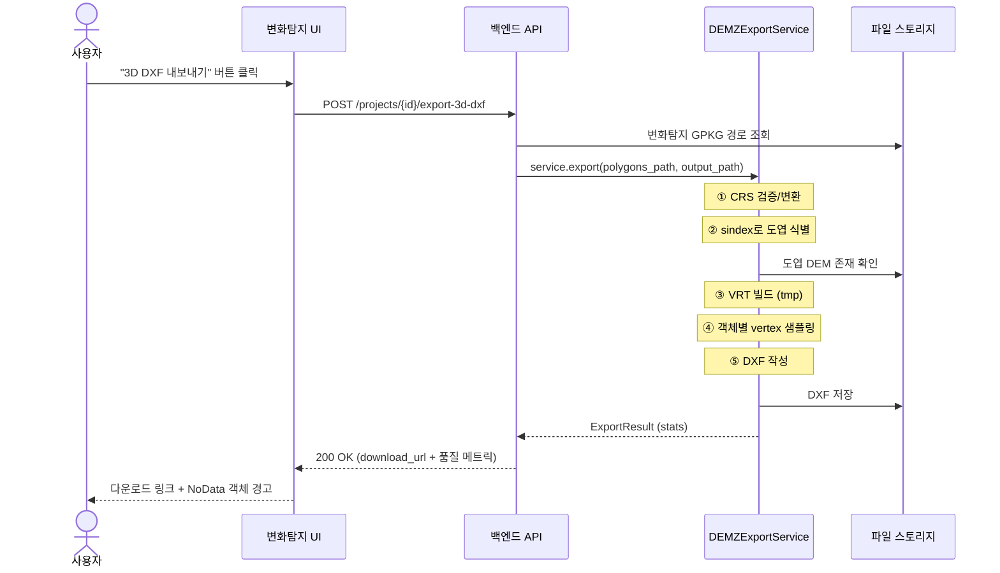

# 3D DXF Export Feature — Integration Spec

> 변화탐지 객체에 DEM Z값을 주입해 3D DXF로 내보내는 기능의 시스템 통합 명세.
> 모듈 자체의 내부 동작은 `dem_z_export.py` 참조. 본 문서는 **시스템에 꽂는 방법**에 집중.

---

## 1. 개요

- **목적**: 변화탐지 프로젝트 UI의 "3D DXF 내보내기" 버튼이 정상 동작하도록 백엔드 통합
- **구현 단위**: `dem_z_export.py` 모듈을 변화탐지 백엔드에 통합 + 1개 엔드포인트 추가
- **변경 범위**: 백엔드 1개 엔드포인트 + 프론트엔드 1개 버튼 + 다운로드 처리

---

## 2. 사전 조건

- [ ] `dem_z_export.py` 모듈 백엔드 코드베이스 반영
- [ ] 필요 의존성 확인: `geopandas`, `rasterio`, `gdal` (osgeo), `ezdxf`, `shapely`, `numpy`
- [ ] 도엽 인덱스 SHP (`TN_MAPINDX_5K_5179`) 백엔드에서 접근 가능한 경로에 배치
- [ ] 도엽별 DEM `.tif` 스토리지 디렉터리 위치 확정
- [ ] DEM 파일명 규칙 확인 (모듈 기본값: `{sheet_code}.tif`)
- [ ] 변화탐지 결과 영구 저장 형식 결정 (GeoPackage 권장)

---

## 3. 런타임 워크플로우



**동기 처리 vs 비동기 처리** — 임계점 결정 필요 (아래 §7 참조). 임계점 미만은 위 sync flow, 초과는 job_id 반환 + polling.

---

## 4. API 컨트랙트

### 4.1 동기 (소규모 프로젝트)

```
POST /api/v1/projects/{project_id}/export-3d-dxf

Request body:
{
  "layer_name": "VARIATION",        // optional, default "CHANGE_DETECTION"
  "sample_method": "bilinear"        // optional, default "bilinear"
}

Response 200:
{
  "download_url": "/files/projects/{project_id}/exports/3d_changes_20260521_143022.dxf",
  "statistics": {
    "total_objects": 234,
    "total_vertices": 4521,
    "sheets_used": ["375081", "375082", ...],
    "missing_sheets": [],
    "nodata_vertex_count": 3,
    "objects_with_nodata": ["obj_142", "obj_188"],
    "elapsed_seconds": 8.4
  }
}

Response 422 (DEM 미비):
{
  "error": "missing_dem",
  "missing_sheets": ["375099", ...],
  "detail": "프로젝트 영역의 도엽 DEM 일부 누락"
}
```

### 4.2 비동기 (대규모 프로젝트) — 임계점 초과 시

```
POST /api/v1/projects/{project_id}/export-3d-dxf
Response 202:
{
  "job_id": "job_abc123",
  "status_url": "/api/v1/jobs/job_abc123"
}

GET /api/v1/jobs/{job_id}
Response 200:
{
  "status": "running" | "completed" | "failed",
  "progress": 0.42,
  "result": { ... ExportResult ... }   // completed 시
}
```

---

## 5. 통합 포인트

### 5.1 서비스 인스턴스 (앱 startup 시 1회)

```python
# backend/services/registry.py (또는 동등 위치)
from dem_z_export import DEMZExportService

dem_z_service: DEMZExportService | None = None

def init_dem_z_service(settings):
    global dem_z_service
    dem_z_service = DEMZExportService(
        sheet_index_path=settings.SHEET_INDEX_PATH,
        dem_dir=settings.DEM_DIR,
        sheet_code_field=settings.SHEET_CODE_FIELD,
        target_crs=settings.TARGET_CRS,
        dem_filename_pattern=settings.DEM_FILENAME_PATTERN,
    )
```

**호출 위치**: FastAPI `@app.on_event("startup")` 또는 Django `AppConfig.ready()`.

### 5.2 엔드포인트

```python
# backend/api/projects/export.py
from services.registry import dem_z_service

@router.post("/{project_id}/export-3d-dxf")
def export_3d_dxf(project_id: str, body: ExportRequest):
    project = get_project(project_id)
    polygons_path = project.change_detection_path
    output_path = build_export_path(project_id)

    result = dem_z_service.export(
        polygons_path=polygons_path,
        output_dxf_path=output_path,
        layer_name=body.layer_name,
    )
    return ExportResponse(
        download_url=build_download_url(output_path),
        statistics=result.to_dict(),
    )
```

### 5.3 출력 경로 규약

```
data/projects/{project_id}/exports/3d_changes_{YYYYMMDD_HHMMSS}.dxf
data/projects/{project_id}/exports/latest.dxf       # 심볼릭링크 (선택)
```

### 5.4 프론트엔드

- 변화탐지 결과 화면에 "3D DXF 내보내기" 버튼 추가
- 클릭 시 로딩 인디케이터 + sync 응답 대기 (또는 job 폴링)
- 응답의 `statistics.objects_with_nodata` 가 비어있지 않으면 **경고 토스트** 표시
- `download_url` 자동 다운로드 트리거

---

## 6. 결정 사항 (이미 합의됨)

| 항목 | 결정 |
|---|---|
| 알고리즘 | VRT + 객체 단위 처리 |
| 샘플링 방식 | bilinear (기본), nearest는 옵션 |
| NoData 처리 | DXF에는 z=0, 객체 ID는 응답에 포함 |
| 다중 도엽 객체 | VRT가 내부 처리, 별도 로직 불필요 |
| CRS | EPSG:5186 (default) |
| Geometry type | 3D POLYLINE (closed) |
| 서비스 lifecycle | 앱 startup 시 1회 인스턴스화, 모든 요청 공유 |

---

## 7. 미해결 결정 사항 (구현 전 합의 필요)

- [ ] **DEM 파일명 정확한 패턴** (`{sheet_code}.tif`? `DEM_{sheet_code}_5m.tif`?)
- [ ] **동기/비동기 임계점** (객체 수 / 도엽 수 / 예상 응답 시간 중 무엇 기준?)
- [ ] **NoData 발생 시 UX** (경고 후 진행 / 강제 차단 / 사용자 선택)
- [ ] **DXF 레이어 컨벤션** (단일 레이어 / 변화유형별 분리)
- [ ] **출력 파일 보관 정책** (덮어쓰기 / 타임스탬프 누적 / N개만 유지)
- [ ] **다운로드 인증** (project 접근 권한 검증 방식)

---

## 8. 수락 기준

- [ ] 단일 도엽 내 객체: 모든 vertex에 DEM Z 정확히 부여, AutoCAD에서 3D 폴리곤으로 정상 표시
- [ ] 도엽 경계 걸친 객체: vertex 간 Z 단차 없음 (또는 DEM 본래 오차 범위 내)
- [ ] DEM 누락 도엽 존재: 422 응답 또는 부분 진행 + 경고 (정책에 따름)
- [ ] NoData vertex: DXF z=0 + 응답의 `objects_with_nodata`에 ID 포함
- [ ] 동기 응답 시간: 10 도엽 / 1,000 객체 기준 30초 이내
- [ ] 재export: 같은 프로젝트에서 반복 호출 시 일관된 결과 + 새 파일 생성
- [ ] CRS 미스매치: 자동 변환 또는 명확한 에러 메시지

---

## 9. Claude Code 시작 프롬프트

> `dem_z_export.py` 모듈을 변화탐지 백엔드에 통합한다. 본 문서의 §5 통합 포인트와 §8 수락 기준을 따른다. §7 미해결 결정 사항은 임의 결정하지 말고 사용자에게 명시적으로 묻고 진행할 것. 모듈 자체는 수정하지 말고 호출 측 코드만 작성. 작업은 다음 순서:
>
> 1. 서비스 인스턴스 등록 (startup 핸들러)
> 2. 엔드포인트 추가 (sync 우선, 비동기는 §7 결정 후 분기)
> 3. 출력 경로/다운로드 처리
> 4. 에러 응답 정의 (DEM 미비, CRS 미스매치, 빈 입력)
> 5. 통합 테스트 작성 (작은 샘플 GPKG + 모킹된 DEM 1–2개)
>
> 작업 중 §7 항목에 막히면 멈추고 사용자에게 질문할 것.

---

## 부록: 디렉터리 구조 권장

```
backend/
├── services/
│   ├── registry.py           # 서비스 인스턴스 보관
│   └── dem_z_export.py       # 본 모듈 (또는 외부 패키지로)
├── api/
│   └── projects/
│       └── export.py         # 신규 엔드포인트
├── schemas/
│   └── export.py             # ExportRequest, ExportResponse Pydantic 모델
└── tests/
    └── api/
        └── test_export.py
data/
├── sheet_index/
│   └── TN_MAPINDX_5K_5179.shp
├── dem/
│   ├── 375081.tif
│   └── ...
└── projects/
    └── {project_id}/
        ├── change_detection.gpkg
        └── exports/
            └── 3d_changes_*.dxf
```
